# Workplace Tracker Service

A comprehensive multi-tenant workplace management system built with Spring Boot. This service provides role-based access control, user management, attendance tracking, task management, and administrative operations across multiple organizational tenants.

---

## **📝 Last Updated :** **`2025-10-17`**

## Table of Contents

* [Project Overview](#project-overview)
* [System Architecture](#system-architecture)
* [Multi-Tenant Architecture](#multi-tenant-architecture)
* [Role-Based Access Control](#role-based-access-control)
* [Features](#features)
* [Tech Stack](#tech-stack)
* [Database Design](#database-design)
* [Authentication Flow](#authentication-flow)
* [API Architecture](#api-architecture)
* [Sequence Diagrams](#sequence-diagrams)
* [Prerequisites](#prerequisites)
* [Quick Start (Local)](#quick-start-local)
* [Environment Variables](#environment-variables)
* [API Overview](#api-overview)
* [Authentication](#authentication)
* [Database & Migrations](#database--migrations)
* [Testing](#testing)
* [Logging & Monitoring](#logging--monitoring)
* [Deployment](#deployment)
* [Troubleshooting](#troubleshooting)
* [Security Notice](#security-notice)
* [Contact & Contributing](#contact--contributing)
* [License](#license)

---

## Project Overview

`workplace-tracker-service` is a sophisticated multi-tenant SaaS backend that enables organizations to manage their workforce effectively. The system supports multiple organizational tenants with complete data isolation, role-based access control, and comprehensive workplace management features including attendance tracking, task management, leave management, and administrative operations.

---

## System Architecture

The system follows a layered multi-tenant architecture with clear separation of concerns:


---

## Multi-Tenant Architecture

The system implements a **shared database, separate schema** multi-tenancy model with three distinct user hierarchies:

```mermaid
graph TD
    subgraph "Platform Level"
        PU[Platform User]
        PU_DESC["• Manages entire platform<br/>• Can create/manage tenants<br/>• Super admin oversight"]
    end
    
    subgraph "Tenant Level"
        SA[Super Admin]
        SA_DESC["• Manages single tenant<br/>• Creates/manages admins<br/>• Tenant-level oversight"]
        
        A[Admin]
        A_DESC["• Manages users/managers<br/>• Department-level control<br/>• Operational management"]
    end
    
    subgraph "User Level"
        M[Manager]
        M_DESC["• Team management<br/>• Task assignment<br/>• Team oversight"]
        
        U[User]
        U_DESC["• End users<br/>• Task execution<br/>• Self-service operations"]
    end
    
    PU --> SA
    SA --> A
    A --> M
    A --> U
    M --> U
    
    PU -.- PU_DESC
    SA -.- SA_DESC
    A -.- A_DESC
    M -.- M_DESC
    U -.- U_DESC
```



---

## Role-Based Access Control

The system implements a sophisticated role-based access control (RBAC) system:

### Role Hierarchy
1. **PLATFORM_USER** - Platform-wide administration
2. **SUPER_ADMIN** - Tenant-level administration
3. **ADMIN** - Organizational administration within tenant
4. **MANAGER** - Team-level management
5. **USER** - End-user operations

### Permission Matrix


---

## Features

### Core Features
* **Multi-tenant Architecture** - Complete tenant isolation
* **Role-based Access Control** - Hierarchical permission system
* **JWT Authentication** - Secure token-based authentication
* **User Management** - Comprehensive user lifecycle management
* **Task Management** - Project and task tracking
* **Leave Management** - Leave policies and approval workflows
* **Attendance Tracking** - Office visits and work patterns
* **Notes & Documentation** - Personal and team notes management

### Advanced Features
* **Database Encryption** - AES encryption for sensitive data
* **Audit Trails** - Complete activity logging
* **Account Security** - Login attempt tracking and account lockout
* **Password Management** - Secure password reset workflows
* **Analytics & Reporting** - Comprehensive business insights
* **Holiday Management** - Configurable holiday calendars
* **Special Days Tracking** - Birthdays and anniversaries

---

## Tech Stack

### Backend Technologies
* **Java 21** - Programming language
* **Spring Boot 3.x** - Application framework
* **Spring Security** - Authentication and authorization
* **Spring Data JPA** - Data persistence
* **Hibernate** - ORM framework
* **PostgreSQL** - Primary database
* **Liquibase** - Database migrations
* **JWT** - Token-based authentication
* **Lombok** - Code generation
* **Gradle** - Build automation

### Infrastructure
* **Docker** - Containerization
* **Kubernetes** - Container orchestration
* **Redis** - Caching (optional)
* **Swagger/OpenAPI** - API documentation

---

## Database Design

### Entity Relationship Diagram


### Key Database Tables

#### Core Identity Tables
- **platform_user** - Platform-level administrators
- **tenant** - Organization/tenant information
- **tenant_user** - Tenant-level users (Super Admin, Admin)
- **user** - End users (Manager, User)
- **user_role** - Role definitions and permissions

#### Operational Tables
- **user_tasks** - Task management
- **user_notes** - Notes and documentation
- **user_leave** - Leave requests and approvals
- **office_visit** - Attendance tracking
- **holiday** - Holiday calendars
- **leave_policy** - Leave policies per tenant

---

## Authentication Flow

### User Registration Flow


### Login Authentication Flow


---

## API Architecture

### API Request Flow


### Tenant Isolation Flow


---

## Sequence Diagrams

### User Management Sequence


### Task Management Flow


---

## Prerequisites

* **Java 17+** installed
* **Maven 3.6+** or **Gradle 7+** installed
* **PostgreSQL 12+** (or Docker for containerized DB)
* **Redis** (optional, for caching)
* **Docker & Docker Compose** (for containerized deployment)

---

## Quick Start (Local)

1. **Clone Repository**
```bash
git clone https://github.com/siddhantpatni0407/workplace-tracker-service.git
cd workplace-tracker-service
```

2. **Configure Database**
```bash
# Using Docker
docker run --name postgres-workplace \
  -e POSTGRES_DB=workplace_tracker_db \
  -e POSTGRES_USER=postgres \
  -e POSTGRES_PASSWORD=password \
  -p 5432:5432 -d postgres:15
```

3. **Configure Environment**
```bash
cp .env.example .env
# Edit .env with your configuration
```

4. **Build and Run**
```bash
# Using Gradle
./gradlew clean build
./gradlew bootRun

# Using Maven
mvn clean package -DskipTests
mvn spring-boot:run
```

5. **Verify Installation**
```bash
curl http://localhost:8010/actuator/health
```

---

## Environment Variables

### Database Configuration
```properties
DB_HOST=localhost
DB_PORT=5432
DB_NAME=workplace_tracker_db
DB_USERNAME=postgres
DB_PASSWORD=password
```

### Application Configuration
```properties
SERVER_PORT=8010
APP_JWT_SECRET=your-256-bit-secret-key
APP_JWT_EXPIRATION_MS=3600000
AES_SECRET_KEY=your-aes-secret-key
AES_ALGORITHM=AES/ECB/PKCS5Padding
```

### Admin Configuration
```properties
ADMIN_USERNAME=admin
ADMIN_PASSWORD=admin123
```

### UI Configuration
```properties
UI_HOST=localhost
UI_PORT=3000
```

---

## API Overview

### Base URL
```
http://localhost:8010/api/v1/workplace-tracker-service
```

### Authentication Endpoints
- `POST /register` - Multi-role user registration
- `POST /login` - User authentication
- `POST /forgot/reset` - Password reset
- `POST /auth/refresh` - Token refresh

### Platform Management (PLATFORM_USER)
- `GET /platform/super-admins` - Manage super admins
- `GET /tenants` - Tenant management
- `GET /subscriptions` - Subscription management

### Tenant Management (SUPER_ADMIN)
- `GET /super-admin/admins` - Manage admins in tenant
- `PUT /super-admin/admins/status` - Admin status management

### User Management (ADMIN)
- `GET /user/fetch` - Get all users
- `GET /user/by-tenant` - Get users by tenant
- `PUT /user/status` - User status management

### Operational Endpoints
- `POST /tasks` - Task management
- `POST /notes` - Notes management
- `POST /user-leaves` - Leave management
- `POST /visits` - Office visit tracking
- `GET /holidays` - Holiday management

### Utility Endpoints
- `POST /db-backup` - Database backup
- `GET /special-days` - Special days tracking
- `GET /analytics/*` - Analytics and reporting

---

## Authentication

### JWT Token Structure
```json
{
  "header": {
    "alg": "HS256",
    "typ": "JWT"
  },
  "payload": {
    "sub": "user@example.com",
    "userId": 123,
    "username": "John Doe",
    "role": "ADMIN",
    "iat": 1634567890,
    "exp": 1634571490
  }
}
```

### Role-based Endpoint Access
```http
# Include JWT token in requests
Authorization: Bearer <jwt-token>
Content-Type: application/json
```

### Account Security
- **Login Attempts**: Maximum 5 failed attempts
- **Account Lockout**: Automatic lockout after max attempts
- **Password Encryption**: AES encryption with versioning
- **Token Expiration**: Configurable JWT expiration (default 1 hour)

---

## Database & Migrations

### Liquibase Migrations
```xml
<!-- Example migration -->
<changeSet id="1" author="siddhant">
    <createTable tableName="platform_user">
        <column name="platform_user_id" type="BIGINT" autoIncrement="true">
            <constraints primaryKey="true"/>
        </column>
        <column name="email" type="VARCHAR(150)">
            <constraints nullable="false" unique="true"/>
        </column>
        <!-- Additional columns -->
    </createTable>
</changeSet>
```

### Database Operations
```bash
# Run migrations
./gradlew update

# Rollback migrations
./gradlew rollback

# Generate SQL
./gradlew updateSQL
```

---

## Testing

### Unit Tests
```bash
./gradlew test
```

### Integration Tests
```bash
./gradlew integrationTest
```

### API Testing Examples
```bash
# Register Platform User
curl -X POST http://localhost:8010/api/v1/workplace-tracker-service/register \
  -H "Content-Type: application/json" \
  -d '{
    "name": "Platform Admin",
    "email": "platform@example.com",
    "password": "SecurePass123",
    "role": "PLATFORM_USER",
    "mobileNumber": "1234567890"
  }'

# Login
curl -X POST http://localhost:8010/api/v1/workplace-tracker-service/login \
  -H "Content-Type: application/json" \
  -d '{
    "email": "platform@example.com",
    "password": "SecurePass123"
  }'

# Access protected endpoint
curl -X GET http://localhost:8010/api/v1/workplace-tracker-service/platform/super-admins \
  -H "Authorization: Bearer <your-jwt-token>" \
  -H "Content-Type: application/json"
```

---

## Logging & Monitoring

### Health Checks
- **Liveness Probe**: `/actuator/health/liveness`
- **Readiness Probe**: `/actuator/health/readiness`
- **General Health**: `/actuator/health`

### Monitoring Endpoints
- `/actuator/metrics` - Application metrics
- `/actuator/info` - Application information
- `/actuator/env` - Environment properties

### Logging Configuration
```yaml
logging:
  level:
    com.sid.app: DEBUG
    org.springframework.security: DEBUG
  pattern:
    console: "%d{HH:mm:ss.SSS} [%thread] %-5level %logger{36} - %msg%n"
```

---

## Deployment

### Docker Deployment
```bash
# Build image
docker build -t siddhantpatni0407/workplace-tracker-service:latest .

# Run container
docker run -d \
  --name workplace-tracker \
  -p 8010:8010 \
  --env-file .env \
  siddhantpatni0407/workplace-tracker-service:latest
```

### Docker Compose
```bash
# Start all services
docker-compose up --build -d

# View logs
docker-compose logs -f workplace-tracker

# Stop services
docker-compose down
```

### Kubernetes Deployment
```bash
# Apply configurations
kubectl apply -f k8s/secret-workplace-tracker.yml
kubectl apply -f k8s/configmap-workplace-tracker.yml
kubectl apply -f k8s/deployment.yml
kubectl apply -f k8s/service.yml

# Verify deployment
kubectl get pods
kubectl logs -f deployment/workplace-tracker-deployment
```

---

## Troubleshooting

### Common Issues

#### 401 Unauthorized
- **Cause**: Invalid or expired JWT token
- **Solution**: Re-authenticate and get new token

#### 403 Forbidden
- **Cause**: Insufficient role permissions
- **Solution**: Verify user role and endpoint requirements

#### Database Connection Issues
- **Cause**: Incorrect database configuration
- **Solution**: Verify `DB_HOST`, `DB_PORT`, `DB_NAME` settings

#### Account Locked
- **Cause**: Too many failed login attempts
- **Solution**: Admin can unlock account via user management API

### Debug Commands
```bash
# Check application logs
docker logs workplace-tracker

# Check database connectivity
docker exec -it postgres-workplace psql -U postgres -d workplace_tracker_db

# Verify JWT token
echo "<jwt-token>" | base64 -d
```

---

## Security Notice

### Important Security Considerations
- **Password Reset**: Current implementation is for development only
- **JWT Secrets**: Use strong, unique secrets in production
- **HTTPS Only**: Always use HTTPS in production environments
- **Database Encryption**: Sensitive data is AES encrypted
- **Tenant Isolation**: Strict data separation between tenants
- **Secret Management**: Use Kubernetes secrets or vault systems

### Production Security Checklist
- [ ] Configure strong JWT secrets
- [ ] Enable HTTPS/TLS
- [ ] Set up proper firewall rules
- [ ] Configure database connection encryption
- [ ] Implement proper secret management
- [ ] Enable audit logging
- [ ] Set up monitoring and alerting

---

## API Documentation

Detailed API documentation is available in the `/docs` folder:

- [Platform User Management API](docs/PLATFORM_USER_MANAGEMENT_API_README.md)
- [Super Admin Management API](docs/SUPER_ADMIN_MANAGEMENT_API_README.md)
- [Authentication API](docs/AUTH_CONTROLLER_API_README.md)
- [Tenant Management API](docs/TENANT_MANAGEMENT_API_README.md)
- [User Tasks API](docs/USER_TASKS_API_README.md)
- [User Notes API](docs/USER_NOTES_API_README.md)

---

## Contact & Contributing

* **Maintainer**: Siddhant Patni
* **Email**: siddhantpatni0407@gmail.com
* **GitHub**: [siddhantpatni0407](https://github.com/siddhantpatni0407)

### Contributing Guidelines
1. Fork the repository
2. Create a feature branch
3. Follow coding standards
4. Add tests for new features
5. Submit a pull request

---

## License

This project is licensed under the MIT License - see the LICENSE file for details.

---

**Note**: This is a comprehensive enterprise-grade application. Please ensure you understand the multi-tenant architecture and security implications before deploying to production.
